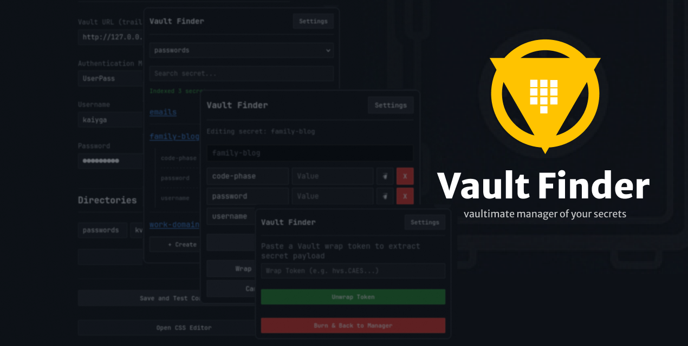

# Vault Finder

**Vault Finder** is a powerful browser extension for seamlessly searching, viewing, and managing secrets in **HashiCorp Vault** (supporting KV v1 and KV v2 engines) with multi-method authentication and full UI customization support.

---



[Firefox Exstension](https://addons.mozilla.org/en-US/firefox/addon/vault-finder) 

---

## Key Features

* **Flexible Authentication Methods:**
  * **UserPass** (`/v1/auth/userpass/`)
  * **LDAP** (`/v1/auth/ldap/`)
  * **Token Authentication** (`/v1/auth/token/lookup-self`) with instant lookup validation.
* **Multi-Directory & KV Engine Support:** Configure multiple KV v2 secret paths and switch between environment targets smoothly.
* **Secret Management & Unwrapping:** Search keys, view/copy secrets, and process wrapped tokens directly within the extension context.
* **Built-in Custom CSS Engine:** Complete design freedom. Modify root variables or inject full custom themes live from the settings page. Includes pre-made themes like [Catppuccin Mocha Blue](./style-catppuccin-mocha.css).
* **Cross-Browser Engine:** Native unified build target for both Chromium and Firefox runtimes.

---

## Security & Data Privacy

* **Local Configuration Persistence:** All Vault connection parameters (URL, tokens, auth modes, and folder mappings) are saved locally using `browser.storage.local`.
* **Direct REST Communication:** Network calls are executed directly between your browser runtime and your configured Vault server endpoint without intermediary proxy layers.
* **Zero Telemetry:** No third-party analytics, background trackers, or telemetry scripts. Because i havent money for it;3 

Use scoped tokens with minimal required policies (e.g. read/write only for your personal KV path) and sensible TTLs. If you paste a root token into a browser extension, no amount of client-side encryption is going to save your infrastructure anyway. 

---

## Custom Styling & CSS API

The application features a flexible CSS Variable system defined in style.css.

You can customize the extension appearance by overriding these variables or providing fully custom style rules in the Custom Appearance Styles (CSS) editor on the Options page.

Preset themes available:

Theme for example: 
- [Github Dark](./.github/assets/style-github.css) 
- [Cattpuccin Mocha Blue](./.github/assets/style-cattpuccin-mocha.css) 

---

## Local Development & Installation

The source code is shared across all supported platforms, but **separate manifest files must be used** depending on your target browser:

* **Chromium (Chrome / Brave / Edge):** Use `manifests/manifest.chrome.json`.
* **Mozilla Firefox:** Use `manifests/manifest.firefox.json` (includes `browser_specific_settings.gecko`).

Before loading the unpacked extension into your browser, copy the appropriate manifest file to the root directory as `manifest.json`:

```bash
# For Chromium browsers
cp manifests/manifest.chrome.json ./manifest.json

# For Firefox
cp manifests/manifest.firefox.json ./manifest.json

```

---

## Build & Release Pipeline

Release zip archives are generated automatically via GitHub Actions (`.github/workflows/build.yml`).

Pushing a version tag (e.g., `git tag v1.0.0 && git push origin v1.0.0`) or triggering the workflow manually produces two distinct build targets attached to the release:

* `vault-finder-chrome.zip`
* `vault-finder-firefox.zip`

---
